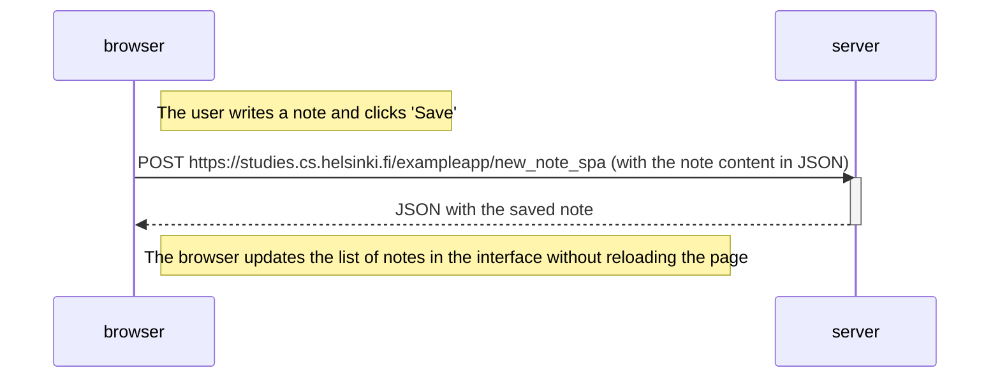

# Exercise 0.6 - Diagram: Creating a new note in the SPA

```mermaid
sequenceDiagram
    participant browser
    participant server

    Note right of browser: The user writes a note and clicks 'Save'

    browser->>server: POST https://studies.cs.helsinki.fi/exampleapp/new_note_spa (with the note content in JSON)
    activate server
    server-->>browser: JSON with the saved note
    deactivate server

    Note right of browser: The browser updates the list of notes in the interface without reloading the page
``` 